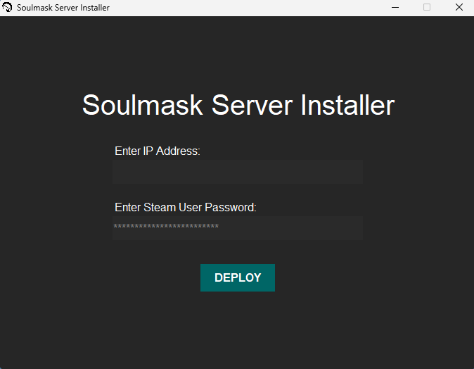

# Soulmask Server Installer
Overview
The Soulmask Server Installer is a GUI tool designed to simplify the process of setting up and deploying a Steam Soulmask game server.

# Features
Graphical User Interface
IP Address Validation
Asynchronous Execution
Progress Indicator

# Usage
Launch the Installer: Double-click the Soulmask Server Installer.exe file to open the application.

Input the IP address of your remote server in the "Enter IP Address" field.
Ensure the IP address format is correct (e.g., 192.168.1.1).

Input the password for the Steam user on the remote server in the "Enter Steam User Password" field.

Click the DEPLOY button to start the deployment process.
The application will check the server availability and execute the necessary commands remotely.
A progress bar will indicate the deployment status.

# License
This project is licensed under the MIT License. See the LICENSE file for details.

